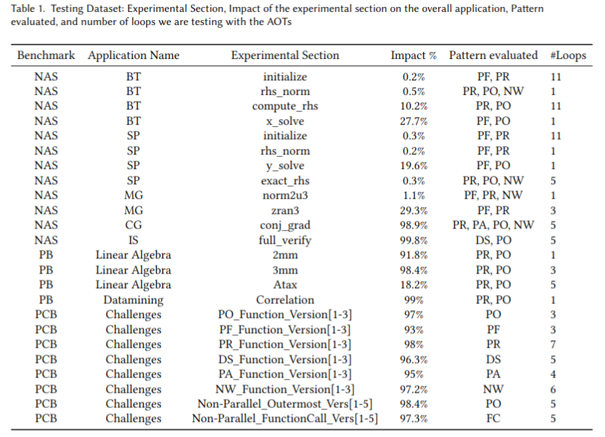
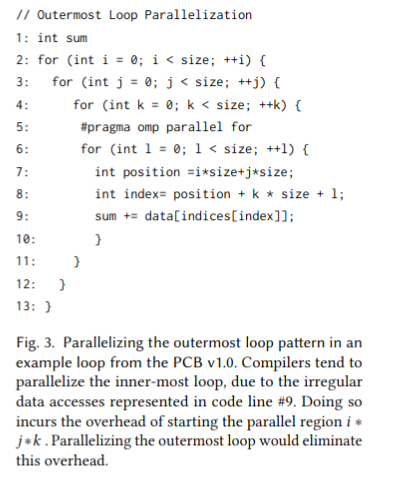
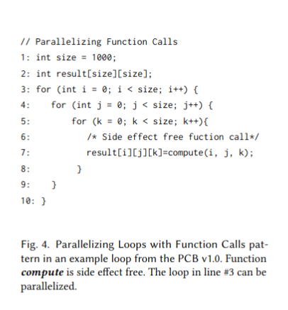
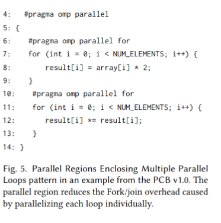
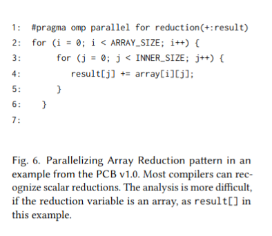

# Testing Data Set

Our test suite drew from three distinct benchmarks: **NPB v3.3**, **PB Suite V4.2**, and the **PCB Benchmark**. For our experiments, we measured the performance of the applications using input **Class B** for the NPB and the **LARGE_DATASET** for the PB and PCB suites.

Recall that we are focusing on challenge patterns for optimizing compilers. We have selected specific subroutines from the NPB and PB suites that contain such cases, resulting in a total of **16 experimental sections**. For the PCB, we developed **28 use cases**, each representing one of the six challenge scenarios. In total, our testing dataset contains **44 experimental sections**. 

**Table 2** below displays our test suite.

| Benchmark | Suite Version | Input Dataset    | Experimental Sections |
|-----------|---------------|-------------------|-----------------------|
| NPB       | v3.3          | Class B           | 12                    |
| PB        | V4.2          | LARGE_DATASET     | 4                    |
| PCB       | v1.0          | LARGE_DATASET     | 28                    |
| **Total** |               |                   | **44**                |

*Table 2: Overview of the Test Suite*

# TESTING_SUITE_AOTs

#  Parallel Computing Challenge Pattern Benchmark Suite v1.0 (PCB)
The PCB Suite was specifically created to address a critical need for unbiased evaluation by ensuring that it has not been exposed to Large Language Models (LLMs) during training. This new benchmark suite comprises 28 distinct use cases, each presenting one of six challenging scenarios encountered by optimizing compilers Barakhshan et al., 2023 Prema et al., 2017. A number of patterns are included in the PCB suite, testing the optimizers in their ability to:

Parallelize outermost loops (PO)
Parallelize loops with function calls (PF)
Form parallel regions enclosing multiple parallel loops (PR)
Parallelizing array reductions (PA)
Avoiding load imbalance through dynamic scheduling (DS)
Eliminate barrier synchronizations using the NOWAIT clause (NW)

These patterns were identified as key challenge areas for classical optimizing compilers Barakhshan et al., 2023 Prema et al., 2017. An important question is:

Can LLMs identify these patterns and perform the requisite optimizations?

The following sections explain four of the involved program patterns: Parallelization of the Outermost Loops (PO), Parallel Regions Enclosing Multiple Parallel Loops (PR), Parallelizing Loops with Function Calls (PF), and Parallelizing Array Reductions (PA). More detailed explanations of these patterns can be found in prior studies Barakhshan et al., 2023.

## Parallelization of the Outermost Loops (PO)
These patterns often represent significant computation tasks. As observed in Figure 3, Outermost Loop Parallelization (PO) improves performance by distributing iterations of the outer loops across multiple processors or threads, minimizing overhead compared to inner-loop parallelism. However, real-world loops often contain complex expressions, limiting static analysis capabilities and leaving compilers more successful with inner loops.

Example: Parallelizing the Outermost Loop Pattern

## Parallelizing Loops with Function Calls (PF)
Loops with function calls (PF) present additional challenges due to the lack of interprocedural analysis in many compilers. For side-effect-free functions that modify only their parameters, parallelization becomes feasible if variable independence is confirmed.

Example: Parallelizing Function Calls Pattern

## Parallel Regions Enclosing Multiple Parallel Loops (PR)
Optimizing compilers often parallelize loops individually, missing opportunities to optimize across multiple loops within a parallel region. Enclosing several loops within a single Parallel Region (PR) reduces the overhead of repeatedly starting and ending parallel loops.

Example: Parallel Regions Enclosing Multiple Parallel Loops Pattern

## Parallelizing Array Reductions (PA)
Parallelizing Array Reductions (PA) performs operations, such as sum, product, min, or max, on elements of an array. Parallelizing these operations requires careful consideration of data dependencies and synchronization to ensure correct results while maximizing parallel execution. Algorithms to perform reductions in parallel are well known PE95, but applying them correctly and beneficially when the result is an array itself can be non-trivial Prema et al., 2017.

Example: Parallelizing Array Reduction Pattern

References
Barakhshan, et al. (2023). Learning Optimizations for Compilers. Link
Prema, et al. (2017). Identifying Optimization Patterns. Link
PE95. Parallel Algorithms for Reductions. Link